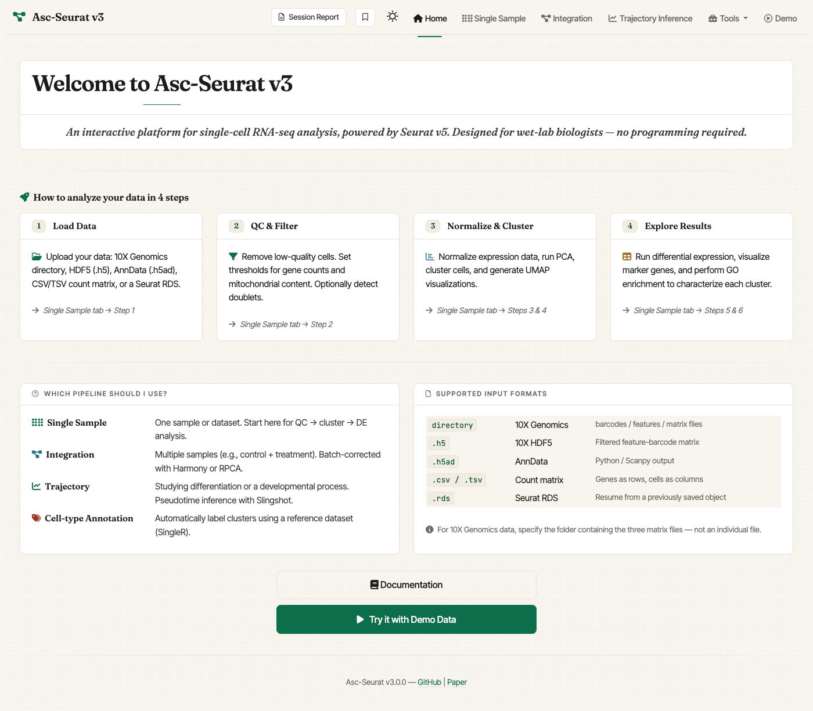
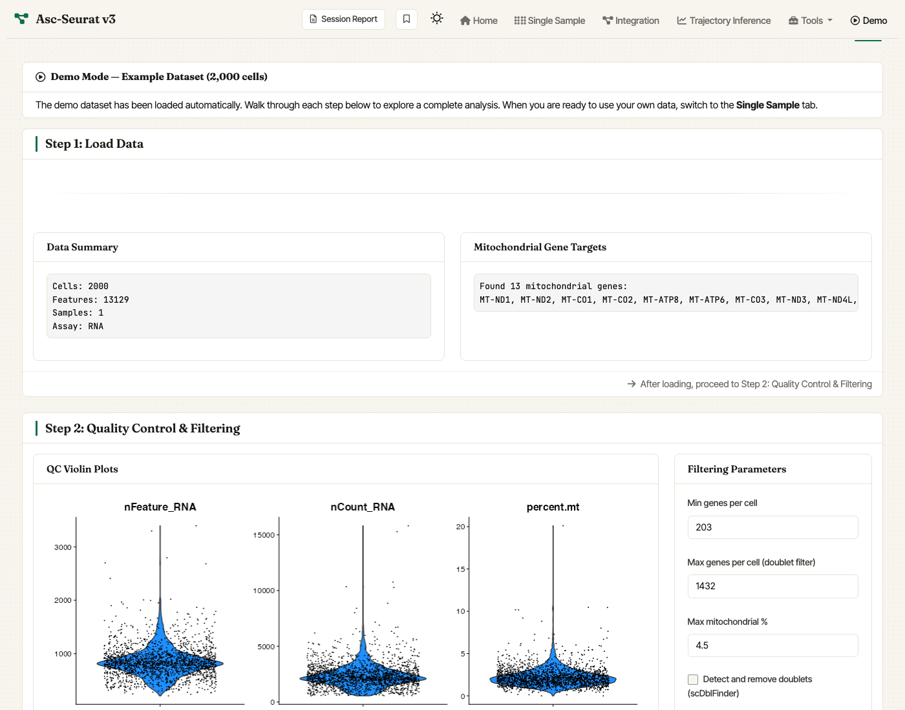

[](https://www.gnu.org/licenses/gpl-3.0) [](https://asc-seurat.readthedocs.io/en/latest/) [](https://doi.org/10.5281/zenodo.4623183)

# Asc-Seurat v3

**Asc-Seurat** is a web application for single-cell RNA-seq analysis, built around [Seurat v5](https://satijalab.org/seurat/). It walks you through the full scRNA-seq data analysis workflow: quality control, normalization, clustering, differential expression, trajectory inference, cell-type annotation, and publication-ready visualization.

**The new release (v3) is a full modernization of the app.** It includes improvements on the interface, removal of outdated tools, easier installation (either as an R package or a Docker image), while maintaining the easy-to-use, end-to-end workflow that made it accessible to users without programming experience.
<break/>
<p align="center">  <br/><em>Asc-Seurat v3 home screen.</em>
</p>

---

## Table of contents

- [What you can do with Asc-Seurat](#what-you-can-do-with-asc-seurat)
- [What's new in v3](#whats-new-in-v3)
- [Quick start](#quick-start)
  - [Option 1 — Docker (recommended)](#option-1--docker-recommended)
  - [Option 2 — R package from GitHub](#option-2--r-package-from-github)
    - [Python dependencies for PAGA (only needed if you are installing the package and dependencies manually).](#python-dependencies-for-paga-only-needed-if-you-are-installing-the-package-and-dependencies-manually)
- [First run: the Demo tab](#first-run-the-demo-tab)
- [Resource and configuration notes](#resource-and-configuration-notes)
- [Documentation](#documentation)
- [Citation](#citation)
- [License](#license)

---

## What you can do with Asc-Seurat

- **Load data from many formats** — 10X Genomics directories, 10X HDF5, CSV/TSV count matrices, AnnData, and existing Seurat objects.
- **Quality control and filtering** — interactive violin plots, per-cell metric thresholds, and optional doublet removal.
- **Normalization and clustering** — `LogNormalize` or `SCTransform`, UMAP and t-SNE embeddings, and a built-in control to rename clusters with biological labels before moving on.
- **Differential expression** — cluster markers, between-cluster DE, and between-sample DE for integrated datasets.
- **Multi-sample integration** — declare your samples inline (no separate config file), set per-sample QC, and integrate with RPCA (Seurat) or Harmony.
- **Trajectory inference** — three supported methods: Slingshot, PAGA, Monocle 3. User can also identify trajectory-associated genes.
- **Cell-type annotation** — automated labelling with against reference atlases.
- **Advanced plots** — stacked violin and multi-gene dot plots, with control over gene and cluster ordering.
- **Per-gene plot bundles** — download a zipped collection of every plot for a selected gene in one click.
- **Bookmarking and session reports** — capture the state of an analysis and reproduce or share it later.

## What's new in v3

- **Available as R package.** Install once from GitHub and launch with `ascseurat::run_app()`.
- **Improved Docker image.** The new image is smaller, faster, and bundles every optional dependency so all features are available out of the box.
- **Refreshed UI** with a built-in Demo to get users familiar with the interface and workflow.
- **Quality-of-life additions.** Bookmarking, session reports, optional doublet removal, cluster renaming.

---

## Quick start

There are two supported ways to install Asc-Seurat. **Docker is the recommended option** if you do not want to manage R and Bioconductor dependencies yourself.

### Option 1 — Docker (recommended)

Requirements: [Docker](https://docs.docker.com/get-docker/) must be installed and running on your machine. Then, in a terminal, run:

```bash
docker pull pereiralabbio/asc-seurat:3 && docker run --rm -p 3838:3838 pereiralabbio/asc-seurat:3
```

Then open <http://localhost:3838> in your browser. That's it.

### Option 2 — R package from GitHub

Recommended for users who already work in R and want a lighter install than the Docker image. Requires **R ≥ 4.3.0**.

From inside an R or R Studio session:

```r
install.packages(c("pak", "remotes"))
remotes::install_github("bnprks/BPCells/r")
pak::pkg_install("Pereira-Lab-UF/asc_seurat", dependencies = TRUE)
```

The middle line pre-installs [BPCells](https://github.com/bnprks/BPCells) (a hard dependency of `monocle3`) via `remotes`, which works around a known `pak` issue with GitHub sub-directory packages.

Or, from a terminal:

```bash
Rscript -e 'if (!requireNamespace("pak", quietly = TRUE)) install.packages(c("pak", "remotes"), repos = "https://cloud.r-project.org"); remotes::install_github("bnprks/BPCells/r"); pak::pkg_install("Pereira-Lab-UF/asc_seurat", dependencies = TRUE)'
```

Then, in the R session, launch the app:

```r
ascseurat::run_app()
```

#### Python dependencies for PAGA (only needed if you are installing the package and dependencies manually).

PAGA uses Python's [Scanpy](https://scanpy.readthedocs.io/) stack via [`reticulate`](https://rstudio.github.io/reticulate/). A one-liner prepares and verifies a managed Python environment:

```r
ascseurat::setup_paga()
```

---

## First run: the Demo tab

You don't need your own data to try Asc-Seurat. After launching:

1. The **Home** page opens. Click **Try it with Demo Data**, or use  the **Demo** tab in the top navigation.
2. A 2,000-cell subset of the PBMC 3k reference dataset is loaded  automatically.
3. Step through **QC → Normalize & Cluster → DE / Visualization**  with the defaults. The full walkthrough finishes in a few minutes  on a laptop.

<p align="center">  <br/><em>The Demo tab auto-loads a PBMC dataset so first-time users can complete the full workflow without supplying data.</em>
</p>

---

## Resource and configuration notes

!!! warning Resource requirements
    Single-cell analysis is memory-intensive. Larger datasets need more RAM whether you use Docker or the R package. We recommend at least 8GB for datasets up to ~20,000 cells, and 16GB or more for larger datasets.

---
## Documentation

- **User documentation**: <https://asc-seurat.readthedocs.io/en/latest/>
- **Source code**: <https://github.com/Pereira-Lab-UF/asc_seurat>
- **Issue tracker**: <https://github.com/Pereira-Lab-UF/asc_seurat/issues>

---

## Citation

If you use Asc-Seurat in your research, please cite the original paper:

> Pereira WJ, Almeida FM, Balmant KM, Rodriguez DC, Triozzi PM, Schmidt HW, Dervinis C, Pappas Jr. GJ, Kirst M. [Asc-Seurat: analytical single-cell Seurat-based web application](https://doi.org/10.1186/s12859-021-04472-2). *BMC Bioinformatics* 22, 556 (2021).
---

## License

Distributed under the **GNU General Public License v3.0**. See [LICENSE](LICENSE) for the full text.
