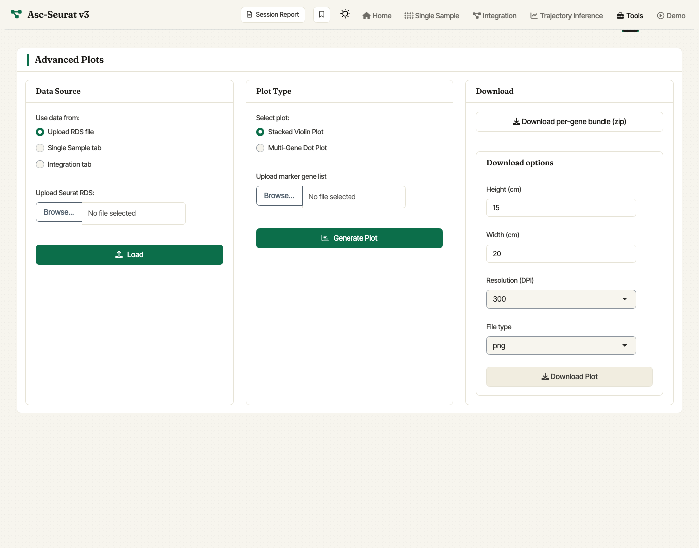
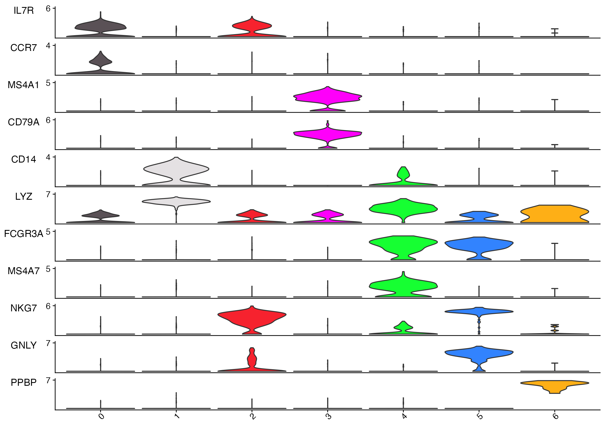
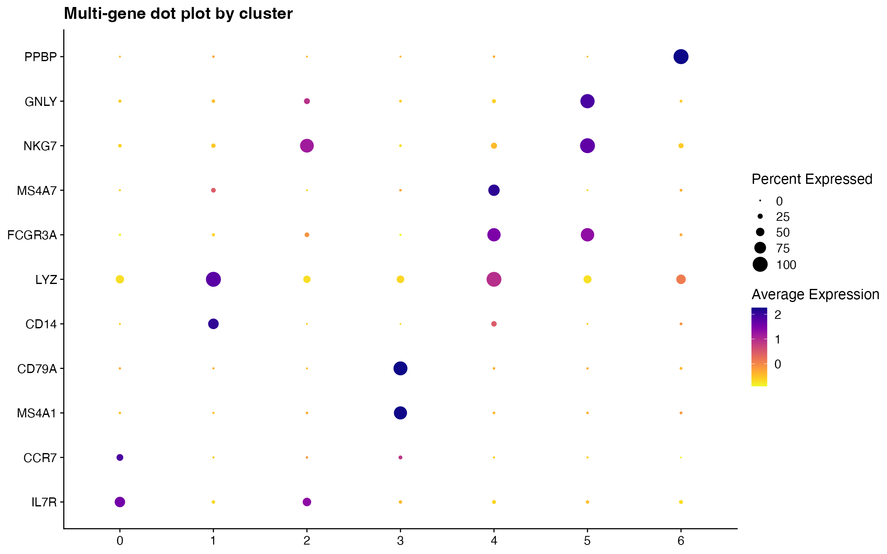

.. _Advanced_plots:

**************
Advanced plots
**************

The **Advanced Plots** tool visualizes multiple genes at once from a
clustered Seurat object. It can use an uploaded RDS file, the current
Single Sample object, or the current Integration object.

   Advanced Plots tab. Choose the data source, upload a gene list, pick
   stacked violin or multi-gene dot plot, and configure download
   settings.

The expression visualization tools (:ref:`single sample
<expression_visualization>`, :ref:`integrated
<expression_visualization_int>`) focus on the standard Step 6 / Step 4
workflow. The **Advanced Plots** tab complements those modules by
plotting many marker genes in one stacked violin plot or one
multi-gene dot plot.

Gene list format
================

Upload a CSV or TSV marker-gene file. The first column should contain
gene IDs. A second column is optional and can be used as a grouping
variable when organizing the gene list. The tool keeps only genes that
are present in the selected Seurat object.

Use **Genes to plot** to include all matching genes or only the first
``N`` genes from the uploaded file. After the first plot is generated,
the ordering panel lets you adjust the display order of genes and
clusters before regenerating the plot.

Stacked violin plot
===================

Stacked violin plots show the distribution of expression for several
genes across clusters in a compact vertical layout. Asc-Seurat builds
this plot with ``scCustomize::Stacked_VlnPlot``.

   Stacked violin plot generated from the Asc-Seurat v3 demo clustered
   PBMC object using common marker genes.

Multi-gene dot plot
===================

The multi-gene dot plot summarizes the same gene set by average
expression and the percentage of cells expressing each gene in each
cluster. Asc-Seurat builds this plot with
``scCustomize::DotPlot_scCustom``.

   Multi-gene dot plot generated from the same marker list and demo
   clustered PBMC object.
