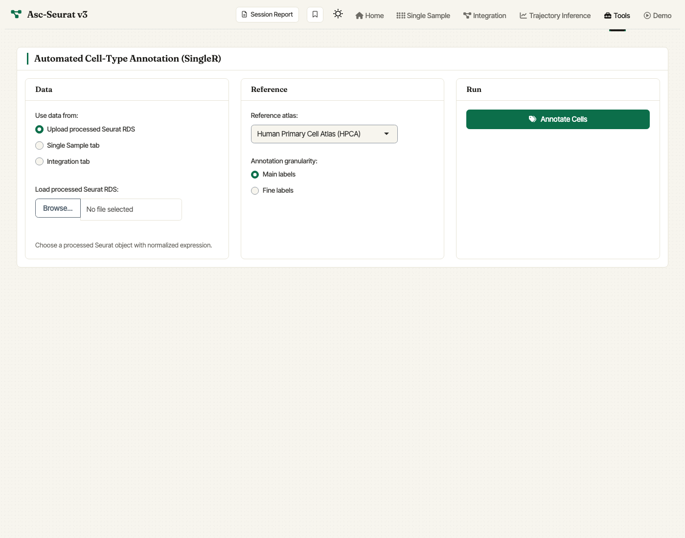

Cell-Type Annotation
====================

Asc-Seurat v3 ships **automated cell-type annotation** via `SingleR
<https://bioconductor.org/packages/release/bioc/html/SingleR.html>`_.
Use the **Cell-type Annotation** entry under *Tools* to run SingleR
against a ``celldex`` reference atlas and attach predicted cell-type
labels to the clustered object. The module works on objects produced by
the Single Sample or Integration tabs, or on processed Seurat RDS files
uploaded directly.

   v3 Cell-type Annotation tab. Point it at a processed Seurat object
   (from the Single Sample or Integration tab, or uploaded as RDS),
   choose a ``celldex`` reference atlas, and pick main or fine labels.

Functional enrichment is intentionally not bundled in v3 so the package
and Docker image stay lighter. Use a dedicated enrichment web service or
standalone R workflow for GO/pathway interpretation.
