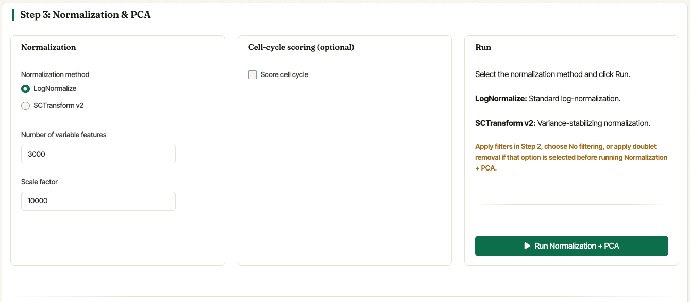
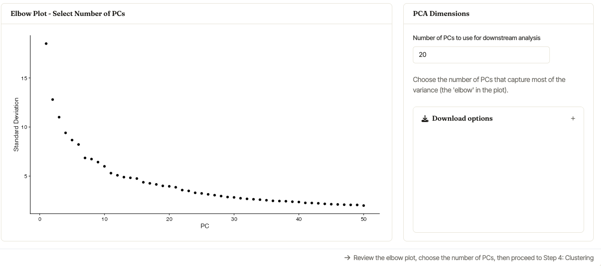
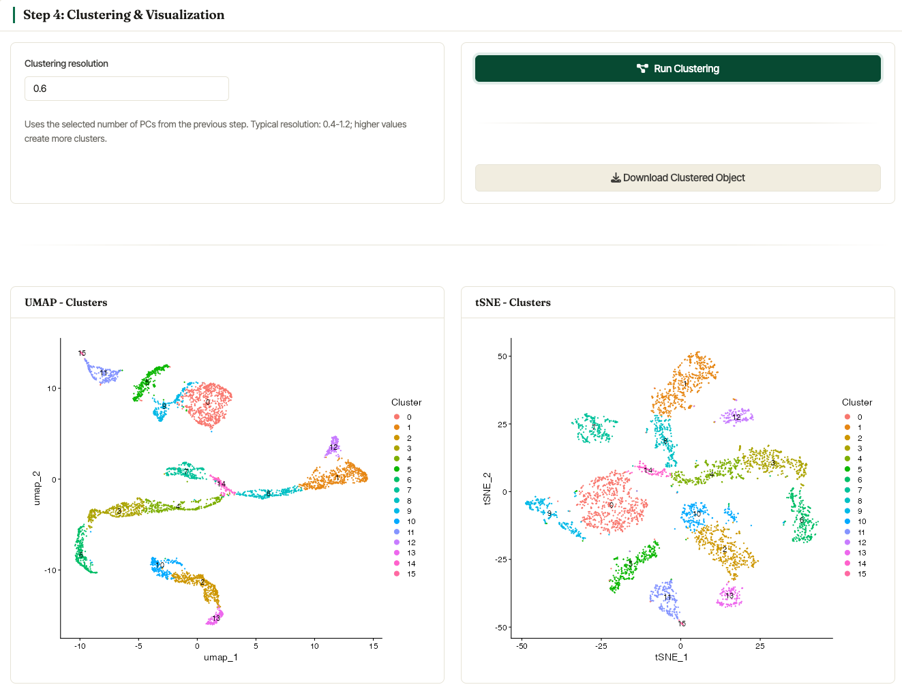

.. _clustering:

**********
Clustering
**********

After filtering the data to remove low-quality cells, Asc-Seurat v3
normalizes the object, runs PCA, clusters the cells, and builds the
embeddings used for downstream interpretation. In the Single Sample
workflow these actions are split across two cards:

- **Step 3: Normalization & PCA** prepares the object and creates the
  PCA elbow plot.
- **Step 4: Clustering & Visualization** runs clustering and displays
  the UMAP/tSNE summaries.

After clustering, the Single Sample tab also lets you **rename
clusters** directly from the UI. This is useful for assigning
biological labels, such as ``T cells`` or ``B cells``, before moving on
to differential expression and marker visualization.

Step 3: Normalization & PCA
===========================

The normalization card supports Seurat's
`LogNormalize <https://satijalab.org/seurat/reference/LogNormalize.html>`_
workflow and `SCTransform v2 <https://satijalab.org/seurat/reference/SCTransform.html>`_.
Choose the method, set the number of variable features, optionally
score cell cycle, and click :guilabel:`Run Normalization + PCA`.

   Step 3 combines normalization settings, optional cell-cycle scoring,
   and the command that runs PCA.

For **LogNormalize**, the scale factor is shown directly in the
Normalization card. The default ``10000`` is appropriate for most
single-cell datasets, but it can be changed when needed. Asc-Seurat
then calls Seurat's
`FindVariableFeatures <https://satijalab.org/seurat/reference/FindVariableFeatures.html>`_
using the requested number of variable features.

For **SCTransform v2**, Asc-Seurat runs variance-stabilizing
normalization and uses the requested number of variable features. When
metadata columns are available, the interface also allows variables to
be regressed out. If cell-cycle scoring is enabled, users can score
human or mouse cell-cycle genes and optionally regress the scores during
scaling.

.. note::

   When SCTransform is selected, Asc-Seurat uses the ``SCT`` assay for
   PCA and clustering, while also preparing normalized ``RNA`` assay
   values for downstream differential expression and expression
   visualization.

Choosing PCA dimensions
=======================

After :guilabel:`Run Normalization + PCA` completes, Asc-Seurat shows
an elbow plot and a **PCA Dimensions** card in the same Step 3 section.
Use the elbow plot to choose how many principal components should be
used for clustering. The selected value is carried into Step 4.

   The elbow plot helps identify a reasonable number of PCs for the
   clustering step. The demo dataset shown here uses the default value
   of ``30`` PCs.

Step 4: Clustering & Visualization
==================================

The clustering card uses the selected PCs from Step 3. Set the
**Clustering resolution** and click :guilabel:`Run Clustering`.
Internally, Asc-Seurat uses Seurat's
`FindNeighbors <https://satijalab.org/seurat/reference/FindNeighbors.html>`_,
`FindClusters <https://satijalab.org/seurat/reference/FindClusters.html>`_,
and dimensionality-reduction plotting functions.

Resolution controls the number of clusters. Larger values generally
split cells into more clusters; smaller values merge them into broader
groups. For datasets of a few thousand cells, values around ``0.4`` to
``1.2`` are common starting points, but the best value depends on the
biological question and marker-gene interpretation.

.. tip::

   There is no single optimal resolution. Try a small set of values and
   evaluate whether known marker genes, expected cell states, and
   downstream differential expression agree with the resulting cluster
   structure.

After clustering, the Single Sample workflow displays a UMAP plot and a
tSNE plot colored by cluster.

   UMAP and tSNE plots generated from the Asc-Seurat v3 demo dataset
   after normalization and clustering.

Asc-Seurat also reports the number of cells assigned to each cluster.
The clustered object can be downloaded from the same section, and plot
download controls are available for exported figures.

Renaming clusters
=================

Once clustering has completed, expand **Rename clusters (optional)** to
replace numeric cluster IDs with biological labels. Click
:guilabel:`Apply New Names` to update the cluster identities stored in
the active object.

.. _target_to_ref_excluding_clusters_one:

Selecting clusters of interest
==============================

The **Cluster Selection / Exclusion (optional)** card can be used to
keep or remove specific clusters before continuing with downstream
analysis. Enable **Reanalyze subset?**, choose whether to **Select** or
**Exclude** clusters, and click :guilabel:`Reanalyze Subset`.

When **Recompute PCA and clusters** is selected, Asc-Seurat creates a
new subset object, recomputes normalization and PCA, and shows an
updated elbow plot. Review the new elbow plot, keep or adjust the
number of PCs in Step 3, and click :guilabel:`Run Clustering` again.

When **Keep current reduction and clusters** is selected, Asc-Seurat
keeps the current embeddings and cluster labels for the selected subset.
This is useful for quickly carrying a subset forward without rerunning
the full clustering workflow.

.. warning::

   Cluster numbering can change after selecting or excluding clusters,
   especially when PCA and clustering are recomputed for the subset.
