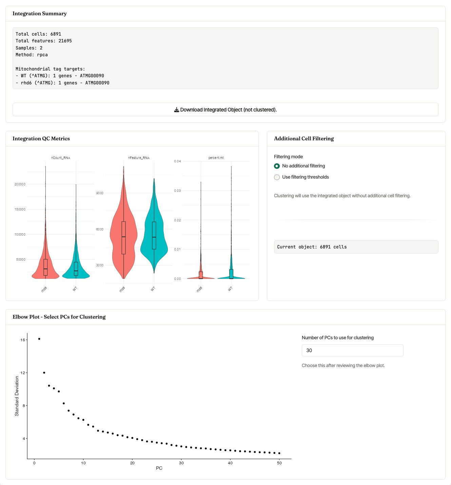
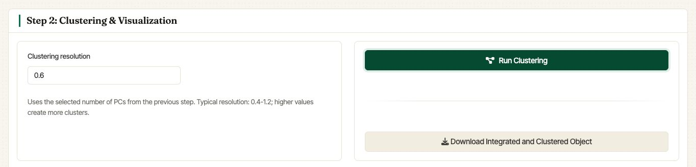
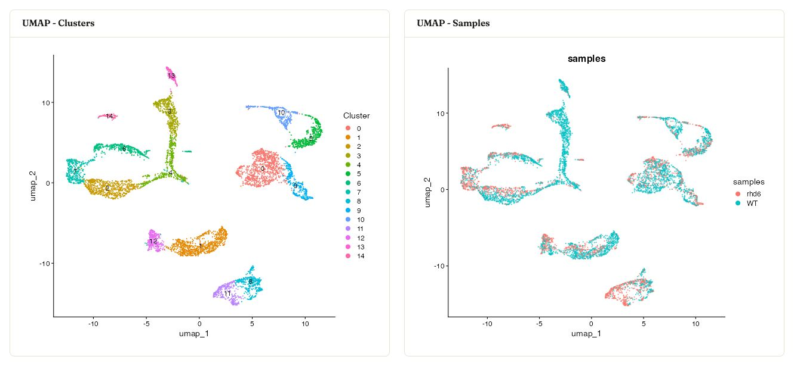
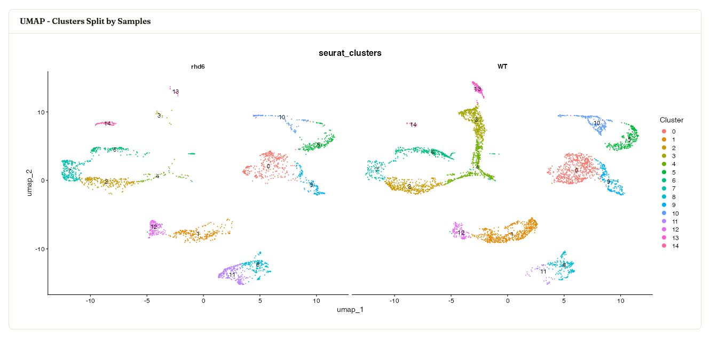
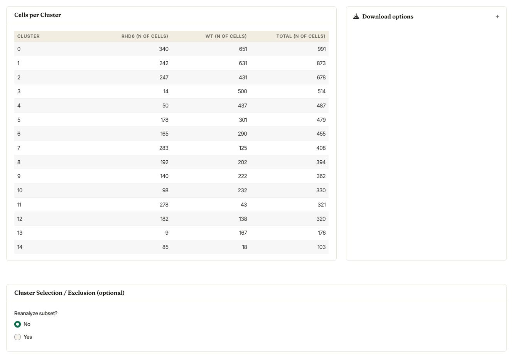

.. _clustering_int:

**********
Clustering
**********

In the **Integration** tab, Asc-Seurat v3 separates multi-sample
integration from clustering:

- **Step 1: Multi-Sample Integration** loads the samples, runs RPCA or
  Harmony integration, shows post-integration QC metrics, and displays
  the PCA elbow plot used to choose clustering dimensions.
- **Step 2: Clustering & Visualization** uses the selected PCs to
  cluster the integrated object and display sample-aware UMAP summaries.

The integrated clustering workflow also supports cluster renaming and
optional cluster selection or exclusion before downstream differential
expression and visualization.

Integration QC and PCA dimensions
=================================

After :guilabel:`Load & Integrate` finishes, Asc-Seurat reports the
number of cells, features, samples, integration method, and
mitochondrial tags used for each sample. The same section displays
integration QC violin plots, optional post-integration filtering, and
the elbow plot used to choose the number of PCs for clustering.

   Integration summary, post-integration QC metrics, optional
   filtering, and the PC selector shown after RPCA integration of the
   WT and rhd6 example samples.

When **SCTransform v2** is selected during integration, Asc-Seurat uses
the ``SCT`` assay through integration and clustering. For downstream
differential expression and expression visualization, Asc-Seurat also
prepares normalized ``RNA`` values so those modules can use the assay
recommended for marker testing and visualization.

Step 2: Clustering & Visualization
==================================

Set the **Clustering resolution** and click :guilabel:`Run Clustering`.
The selected number of PCs comes from the Step 1 PC selector. Internally,
Asc-Seurat uses Seurat's
`FindNeighbors <https://satijalab.org/seurat/reference/FindNeighbors.html>`_,
`FindClusters <https://satijalab.org/seurat/reference/FindClusters.html>`_,
and UMAP workflow on the integration reduction.

   Step 2 controls for clustering the integrated object.

Resolution controls the number of clusters. Larger values generally
split cells into more clusters; smaller values merge them into broader
groups. There is no single optimal resolution, so compare a small set of
values against expected marker genes and the biological question.

Integrated UMAP summaries
=========================

After clustering, Asc-Seurat displays the integrated UMAP colored by
cluster and the same embedding colored by sample.

   Integrated UMAPs from the WT and rhd6 example samples, colored by
   cluster and by sample.

The workflow also shows the cluster labels split by sample, which makes
it easier to spot sample-specific cluster composition or uneven mixing.

   Integrated UMAP split by sample while retaining the cluster labels.

Cells per cluster and subsetting
================================

Asc-Seurat reports the number of cells assigned to each cluster, broken
down by sample. The **Cluster Selection / Exclusion (optional)** card can
be used to keep or remove selected clusters before downstream analysis.

   Cells per cluster table and the optional cluster selection /
   exclusion card.

When **Recompute PCA and clusters** is selected, Asc-Seurat creates a
new subset object, recomputes normalization and PCA, and shows an
updated elbow plot before clustering the subset again. When **Keep
current reduction and clusters** is selected, the current embedding and
cluster labels are carried forward for the selected subset.

.. warning::

   Cluster numbering can change after selecting or excluding clusters,
   especially when PCA and clustering are recomputed for the subset.
