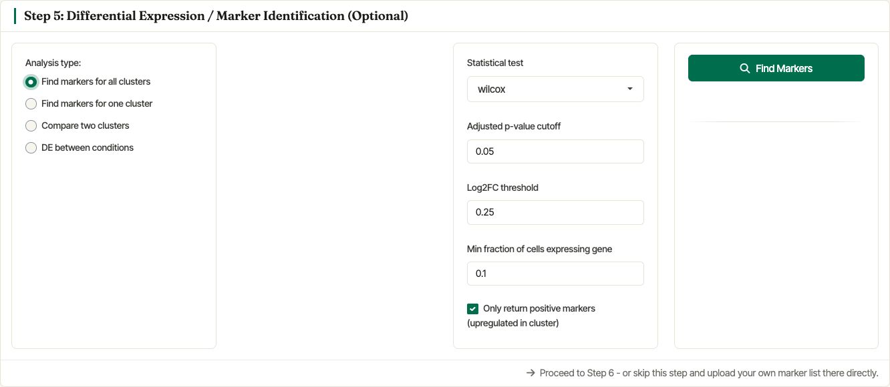
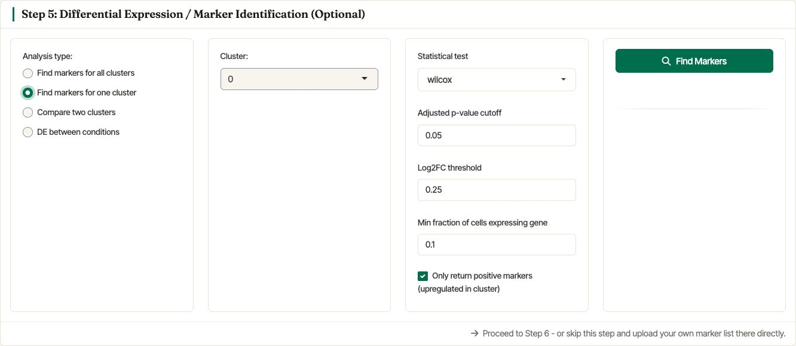
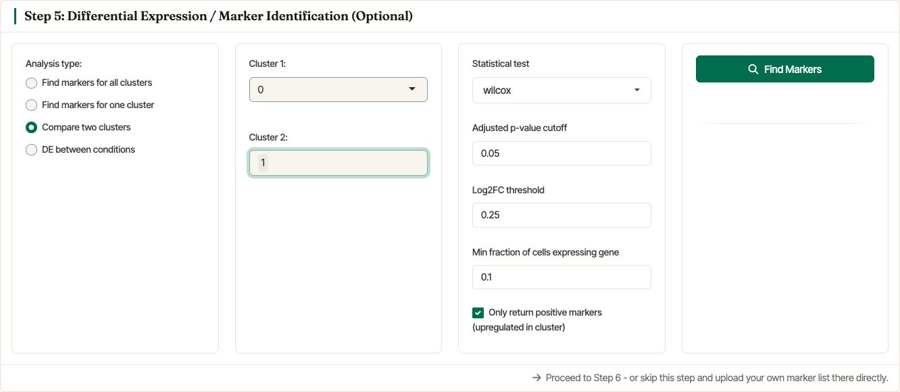
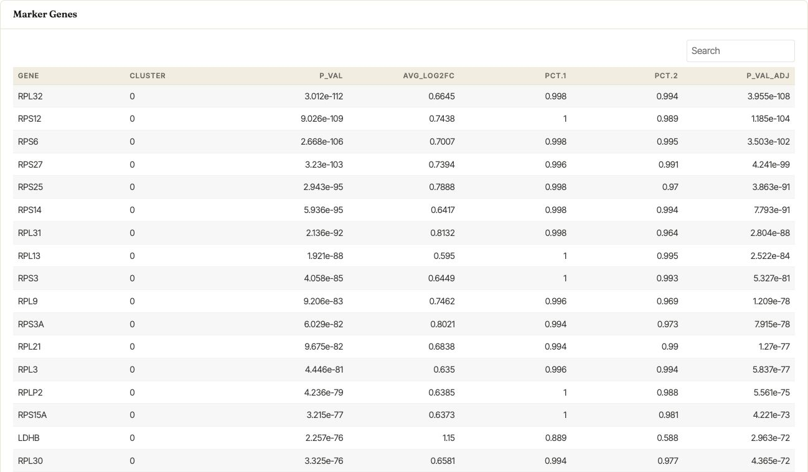

.. _differental_expression:

***********************************************************
Markers identification and differential expression analysis
***********************************************************

After clustering the cells, users may be interested in identifying
genes specifically expressed in one cluster (markers) or in genes that
are differentially expressed between clusters or conditions of
interest. Asc-Seurat v3 exposes these options in **Step 5:
Differential Expression / Marker Identification (Optional)**. The
module uses Seurat's `FindMarkers
<https://satijalab.org/seurat/reference/FindMarkers.html>`_ and
`FindAllMarkers
<https://satijalab.org/seurat/reference/FindAllMarkers.html>`_
workflows.

Once a DE table is available, you can send selected genes **directly
to the visualization module** without exporting and re-importing a
CSV. The CSV export still works and is the recommended format for
sharing gene lists outside the app.

Asc-Seurat lets users choose the analysis type, statistical test,
adjusted p-value cutoff, log2 fold-change threshold, and minimum
fraction of cells expressing a gene. The same panel can search markers
for all clusters, one selected cluster, two selected clusters, or
conditions stored in the object's metadata.

   Settings for finding marker genes for all clusters using the Wilcoxon
   test and the default filtering thresholds.

   Settings for finding markers for one selected cluster.

   Settings for comparing two selected clusters.

After the search runs, Asc-Seurat displays an interactive marker table.
Users can search within the table and download the significant markers
or DEGs as a CSV file.

   Marker-gene table generated from the Asc-Seurat v3 demo dataset.

The list of genes in the CSV can then be used to visualize expression
patterns in a series of plots, as shown in the section
:ref:`expression_visualization`.
