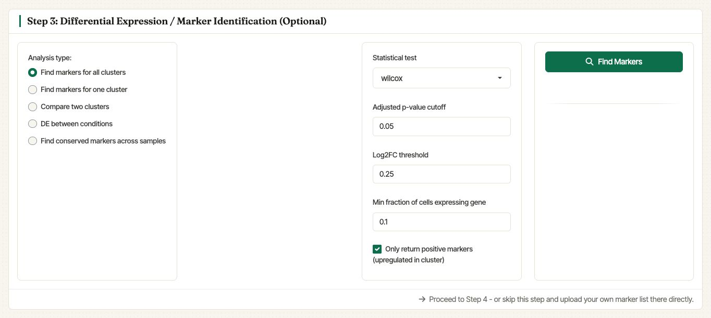
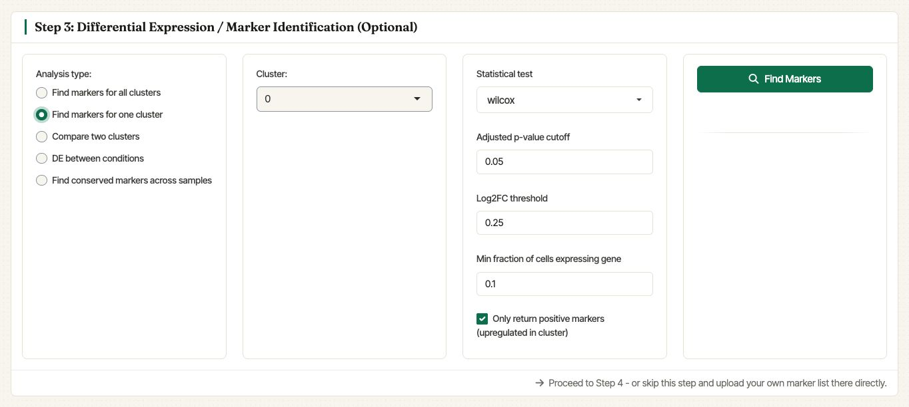
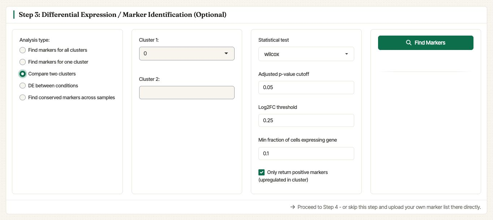
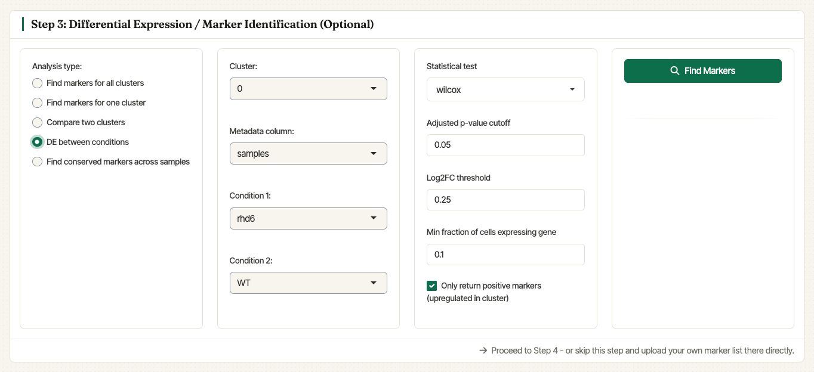
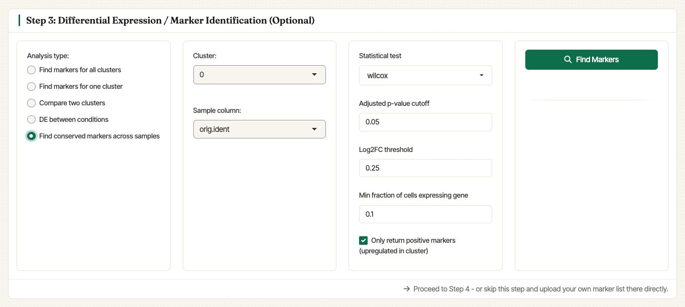
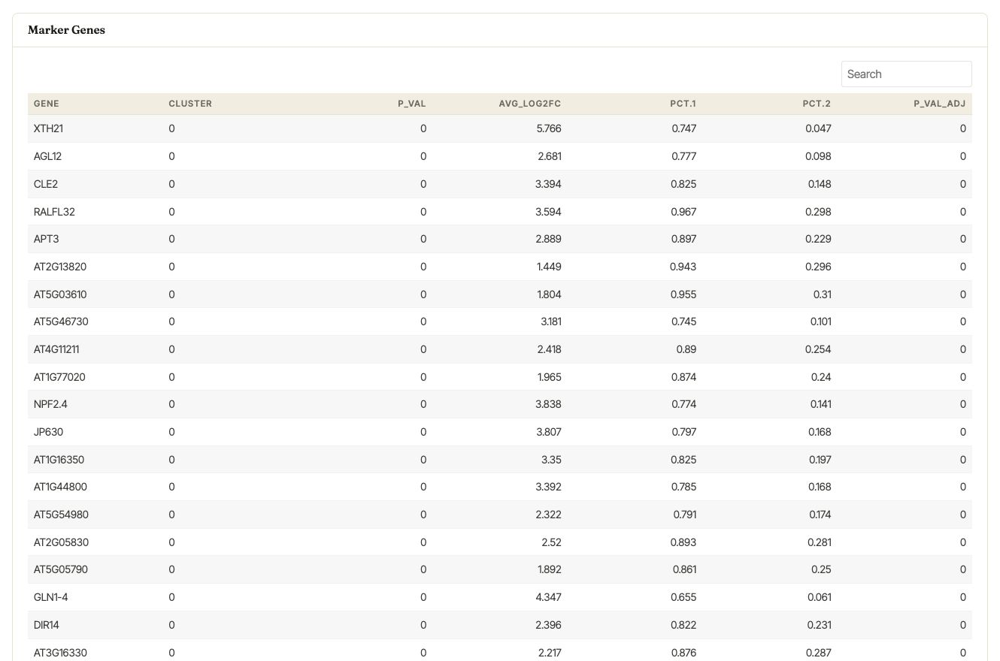

.. _differental_expression_int:

***********************************************************
Markers identification and differential expression analysis
***********************************************************

After integrated clustering, Asc-Seurat v3 exposes marker testing in
**Step 3: Differential Expression / Marker Identification (Optional)**.
The integrated workflow supports the same core options as the
single-sample workflow, plus sample-aware tests for multi-sample
objects.

Selected marker genes can be sent directly from the results table to
the integrated visualization module (see
:ref:`expression_visualization_int`). You can also download the results
as a CSV file for external use.

Analysis modes
==============

The integrated DE panel can:

- find markers for all clusters;
- find markers for one selected cluster;
- compare two selected clusters;
- test differential expression between conditions within a selected
  cluster;
- find conserved markers across samples for a selected cluster.

All modes share the statistical test selector, adjusted p-value cutoff,
log2 fold-change threshold, minimum fraction of cells expressing the
gene, and the option to return only positive markers.

   Settings for finding marker genes for all clusters in the integrated
   object.

   Settings for finding markers for one selected cluster.

   Settings for comparing two selected clusters.

   Settings for testing differential expression between sample
   conditions within a selected cluster.

   Settings for finding conserved markers across samples.

Marker table
============

After the search runs, Asc-Seurat displays an interactive marker table.
The table can be searched, paged, and downloaded as CSV. The selected
genes can also be passed directly to **Step 4: Gene Expression
Visualization** without re-uploading a marker list.

   Marker table generated for cluster 0 of the integrated WT and rhd6
   example samples.
