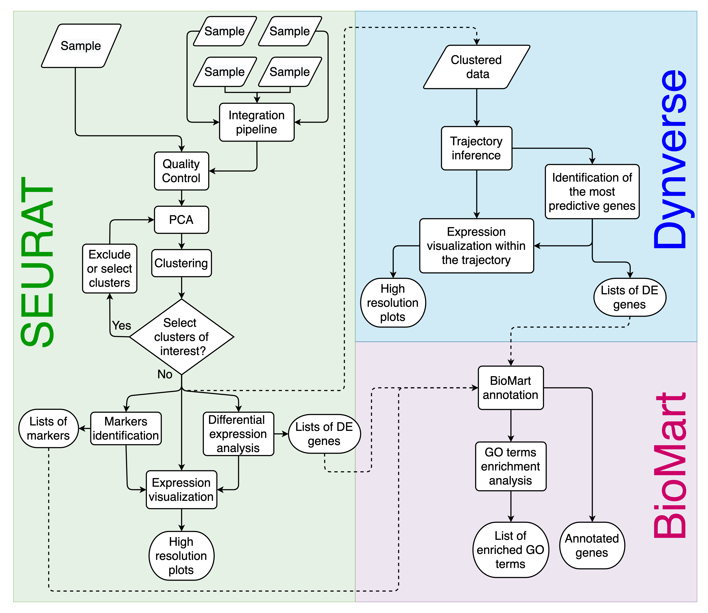

Asc-Seurat v3 documentation
===========================

Welcome to the Asc-Seurat v3 user guide.

**Asc-Seurat** is a click-driven Shiny application for single-cell
RNA-seq analysis, built around `Seurat v5 <https://satijalab.org/seurat/>`_.
It walks you through the full workflow — quality control, normalization,
clustering, differential expression, trajectory inference, cell-type
annotation, and publication-ready visualization — without writing any
R code.

**v3 is a full modernization of the app.** It preserves the published
Asc-Seurat workflow structure while replacing the fragile v2 components
that depended on Dynverse Docker images and BioMart web requests, and
reshipping the codebase as a proper R package. Once the dependencies
are installed, the entire workflow runs **offline**.

The v3 workflow is organized around:

- Single-sample analysis
- Multi-sample integration (RPCA by default, Harmony available)
- Trajectory inference with Slingshot, PAGA, and Monocle 3
- Automated cell-type annotation with SingleR
- Doublet detection with scDblFinder
- Advanced visualization and per-gene plot export

.. figure:: images/v3/v3_home.png
   :alt: Asc-Seurat v3 home screen.
   :width: 100%
   :align: center

   **Asc-Seurat v3 home screen.** An editorial-style layout with a
   single emerald accent on parchment, an inline quick-start guide,
   and top-level tabs for every workflow.

   **Asc-Seurat workflow overview.** v3 keeps the familiar navigation
   structure while modernizing the analytical backend.

Where to start
--------------

- **First time here?** Install Asc-Seurat (:ref:`installation`) and
  then follow the :ref:`getting_started` walkthrough. The built-in
  **Demo** tab auto-loads a 2,000-cell PBMC dataset so you can try
  every step without supplying your own data.
- **Coming from Asc-Seurat v2?** Read :doc:`migrating` first — the
  input formats are unchanged and old ``.rds`` files still load, but
  several internal methods have changed.
- **Ready to load your data?** Jump to
  :ref:`single-sample loading <loading_data>`,
  :ref:`integration loading <loading_data_int>`, or
  :doc:`trajectory_inference`.

Highlights of v3
----------------

- **Proper R package.** Install from GitHub with
  ``pak::pkg_install(...)`` and launch with
  ``ascseurat::run_app()``. The Docker image
  (``kirstlab/asc_seurat:3``) remains available and is recommended for
  users who don't want to manage R / Bioconductor dependencies
  directly. See :ref:`installation`.
- **Seurat v5 throughout.** Older Seurat objects are upgraded
  automatically via ``UpdateSeuratObject()`` when you load them.
- **Refreshed UI.** An editorial "lab notebook" style — single emerald
  accent on parchment, Fraunces serif headings, hairline borders —
  plus an integrated **Demo** tab that auto-loads a 2,000-cell PBMC
  dataset, a top-level **Tools** menu for the secondary workflows
  (Cell-type Annotation, Advanced Plots), and a direct
  DE → visualization hand-off.
- **Three trajectory methods**: Slingshot (default), PAGA, and
  Monocle 3. The root/start cluster is strongly recommended;
  Slingshot can also use an optional end cluster and shows an MST
  graph of the inferred cluster relationships. Gene discovery is
  available for all three methods — Slingshot trajectory DE
  (``PseudotimeDE-fast`` recommended default, plus ``scMaSigPro`` and
  ``tradeSeq``), PAGA connected-state markers and pseudotime-associated
  genes, and Monocle 3 graph-variable genes.
- **Multiple input formats.** 10X Genomics directories, 10X HDF5
  (``.h5``), CSV / TSV count matrices, AnnData (``.h5ad``) via
  ``anndataR``, and existing Seurat ``.rds`` files.
- **Multi-sample integration with RPCA** (Seurat v5 ``IntegrateLayers``)
  by default, or Harmony.
- **Built-in quality-of-life features**: bookmarking, session reports,
  cluster renaming, optional ``scDblFinder`` doublet detection
  independent of QC filtering, SingleR annotation, per-gene
  plot-bundle export, and a direct DE → visualization hand-off.

.. note::

   The chrome-level screenshots in this documentation have been
   captured on the v3 interface. Per-step output plots (dot plots,
   UMAPs, etc.) shown in later sections are unchanged from v2 — the
   analytical backends produce the same plot types.

.. toctree::
   :hidden:
   :caption: General information
   :maxdepth: 2

   installation
   getting_started
   migrating
   references
   packages_version
   license

.. toctree::
   :hidden:
   :caption: Analysis of individual sample
   :maxdepth: 4

   loading_data
   quality_control
   clustering
   differential_expression
   expression_visualization

.. toctree::
   :hidden:
   :caption: Analysis of multiple samples
   :maxdepth: 4

   loading_data_int
   quality_control_int
   clustering_int
   differential_expression_int
   expression_visualization_int

.. toctree::
   :hidden:
   :caption: Trajectory inference
   :maxdepth: 4

   trajectory_inference

.. toctree::
   :hidden:
   :caption: Cell-type annotation
   :maxdepth: 4

   annotation

.. toctree::
   :hidden:
   :caption: Advanced plots
   :maxdepth: 4

   Advanced_plots

.. note::

   The original v2.1 documentation remains available at ``/en/v2.1/``
   on Read the Docs for historical reference.
