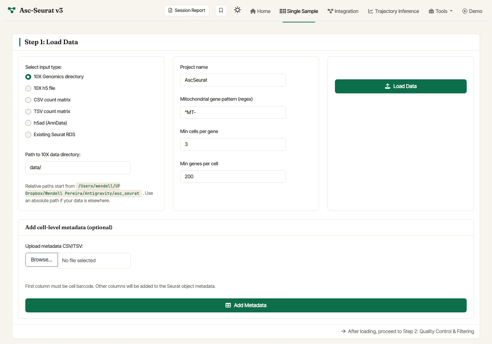

.. _loading_data:

****************************************
Loading the data of an individual sample
****************************************

The Single Sample tab reads 10X Genomics directories, 10X HDF5 files , CSV / TSV count matrices, AnnData files, and existing Seurat RDS files. Selecting an input type
reveals the matching path or upload control.

Loading the data
================

To analyze an individual sample, select the **Single Sample** tab in
the navigation bar. Step 1 of the tab — *Load Data* — handles the
input.

   Single Sample — Step 1. Pick an input type, fill in the matching
   path or upload control, set the initial filtering parameters, and
   click **Load Data**.

The *Load Data* card has three columns:

#. **Select input type** (left column). Choose between:

   - ``10X Genomics directory`` — folder with ``matrix.mtx.gz``,
     ``barcodes.tsv.gz``, and ``features.tsv.gz``. Reveals a *Path to
     10X data directory* control.
   - ``10X h5 file`` — single ``.h5`` file from Cell Ranger.
   - ``CSV count matrix`` / ``TSV count matrix`` — comma- or
     tab-separated count matrix; first column is gene IDs, header is
     cell barcodes.
   - ``h5ad (AnnData)`` — AnnData file; loaded through ``anndataR``.
   - ``Existing Seurat RDS`` — resume from a Seurat object saved
     earlier. Older Seurat objects are upgraded automatically via
     ``UpdateSeuratObject()``.

#. **Initial parameters** (middle column). These are passed to Seurat's
   `CreateSeuratObject <https://satijalab.org/seurat/reference/createseuratobject>`_
   and `PercentageFeatureSet <https://satijalab.org/seurat/reference/PercentageFeatureSet.html>`_:

   - **Project name**: label used in some plots (default ``AscSeurat``).
   - **Mitochondrial gene pattern (regex)**: regular expression used to
     identify mitochondrial transcripts. ``^MT-`` (default) works for
     human; use ``^mt-`` for mouse, ``^ATMG`` for *Arabidopsis*, etc.
   - **Min cells per gene**: include genes detected in at least this
     many cells (default ``3``).
   - **Min genes per cell**: include cells expressing at least this many
     genes (default ``200``).

#. **Path / upload + Load Data** (right column). Relative paths in the
   path field are resolved against the working directory shown beneath
   the field; absolute paths work too when they are visible to the app
   process. In Docker, host paths such as ``/Users/...`` must be
   bind-mounted first. The simplest Docker workflow is to launch the
   image from the directory where your data lives with
   ``-v "$PWD:/home/ascseurat/data:ro"``, then enter a path such as
   ``data/sample/filtered_feature_bc_matrix``. If the mounted folder is
   the 10X matrix directory, enter ``data/``. Alternatively, mounting
   ``-v "$HOME:$HOME:ro"`` lets macOS and Linux users paste normal paths
   under their home directory. Click **Load Data** to read the sample.

Optionally, the *Add cell-level metadata* card at the bottom of Step 1
lets you upload a CSV/TSV whose first column is the cell barcode; the
remaining columns are added to the Seurat object's ``meta.data`` when
you click **Add Metadata**.

After loading, a violin plot of QC metrics appears in **Step 2:
Quality Control & Filtering**, where you can set tighter thresholds
before clustering. See :ref:`quality control <quality_control>`.
