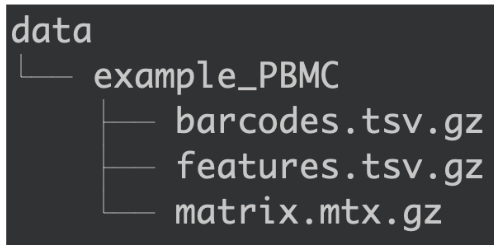
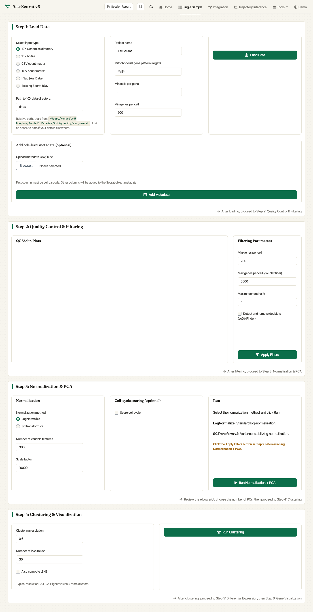

.. _loading_data:

****************************************
Loading the data of an individual sample
****************************************

.. note::

   **New in v3:** if you just want to try Asc-Seurat, use the :ref:`Demo
   tab <getting_started>` — it auto-loads a 2,000-cell PBMC dataset for
   you. The instructions below apply when you are loading your own data.

.. note::

   **Multiple input formats (new in v3).** The Single Sample tab can read
   10X Genomics directories, 10X HDF5 files (``.h5``), CSV / TSV count
   matrices, AnnData (``.h5ad``) files via ``anndataR``, and existing
   Seurat RDS files. Selecting an input
   type reveals the matching path or upload control.

Location of the dataset
========================

For path-based 10X loading, place datasets in a subdirectory inside the
:code:`data/` directory. The built-in Demo tab instead loads a bundled
2,000-cell subset of the public `10× Peripheral Blood Mononuclear Cells
(PBMC) 3k dataset <https://cf.10xgenomics.com/samples/cell/pbmc3k/pbmc3k_filtered_gene_bc_matrices.tar.gz>`_.

   Organization of the :code:`data/` directory.

Therefore, to add the dataset, create a subdirectory inside :code:`data/` containing the counts' matrix (*matrix.mtx.gz*), cell barcodes (*barcodes.tsv.gz*), and gene names (*features.tsv.gz*).

Asc-Seurat provides separated environments (tabs) to analyze a single sample and the integrated analysis of multiple samples.

Format of the dataset
=====================

Asc-Seurat can only read the input files in the format generated by `Cell Ranger (10x genomics) <https://support.10xgenomics.com/single-cell-gene-expression/software/pipelines/latest/what-is-cell-ranger>`_. However, it is possible to convert your counts' matrix to the acceptable format. For example, the function `write10xCounts() <https://rdrr.io/github/MarioniLab/DropletUtils/man/write10xCounts.html>`_, from the `DropletUtils <https://bioconductor.org/packages/release/bioc/html/DropletUtils.html>`_ package, is an easy option to make this conversion.

.. tip::

    Using `write10xCounts() <https://rdrr.io/github/MarioniLab/DropletUtils/man/write10xCounts.html>`_, users can provide as output the path to the :code:`data/` directory. In this way, Asc-Seurat can recognize the files automatically.

Loading the data
================

To analyze an individual sample, select the **Single Sample** tab in
the navigation bar. Step 1 of the tab — *Load Data* — handles the
input.

   v3 Single Sample — Step 1. Pick an input type, fill in the matching
   path or upload control, set the initial filtering parameters, and
   click **Load Data**.

The *Load Data* card has three columns:

#. **Select input type** (left column). Choose between:

   - ``10X Genomics directory`` — folder with ``matrix.mtx.gz``,
     ``barcodes.tsv.gz``, and ``features.tsv.gz``. Reveals a *Path to
     10X data directory* control.
   - ``10X h5 file`` — single ``.h5`` file from Cell Ranger.
   - ``CSV count matrix`` / ``TSV count matrix`` — comma- or
     tab-separated count matrix; first column is gene IDs, header is
     cell barcodes.
   - ``h5ad (AnnData)`` — AnnData file; loaded through ``anndataR``.
   - ``Existing Seurat RDS`` — resume from a Seurat object saved
     earlier (Asc-Seurat v2 RDS files are upgraded automatically via
     ``UpdateSeuratObject()``).

#. **Initial parameters** (middle column). These are passed to Seurat's
   `CreateSeuratObject <https://satijalab.org/seurat/reference/createseuratobject>`_
   and `PercentageFeatureSet <https://satijalab.org/seurat/reference/PercentageFeatureSet.html>`_:

   - **Project name**: label used in some plots (default ``AscSeurat``).
   - **Mitochondrial gene pattern (regex)**: regular expression used to
     identify mitochondrial transcripts. ``^MT-`` (default) works for
     human; use ``^mt-`` for mouse, ``^ATMG`` for *Arabidopsis*, etc.
   - **Min cells per gene**: include genes detected in at least this
     many cells (default ``3``).
   - **Min genes per cell**: include cells expressing at least this many
     genes (default ``200``).

#. **Path / upload + Load Data** (right column). Relative paths in the
   path field are resolved against the working directory shown beneath
   the field; absolute paths work too. Click **Load Data** to read the
   sample.

Optionally, the *Add cell-level metadata* card at the bottom of Step 1
lets you upload a CSV/TSV whose first column is the cell barcode; the
remaining columns are added to the Seurat object's ``meta.data`` when
you click **Add Metadata**.

After loading, a violin plot of QC metrics appears in **Step 2:
Quality Control & Filtering**, where you can set tighter thresholds
before clustering. See :ref:`quality control <quality_control>`.
