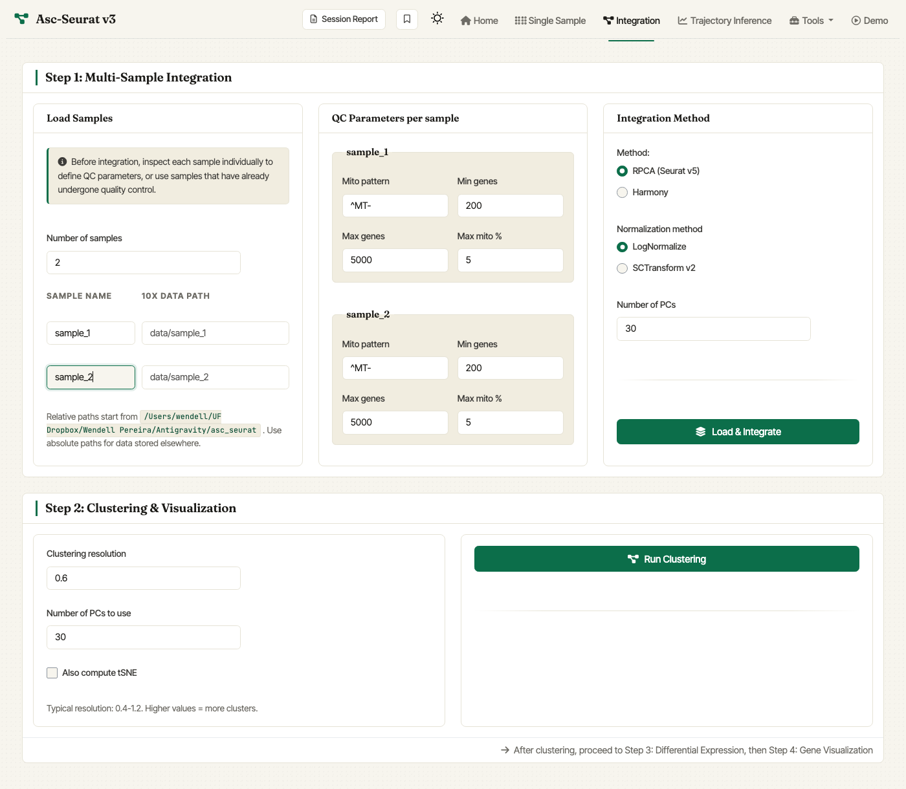

.. _loading_data_int:

****************************************************
Loading the data and integration of multiple samples
****************************************************

To analyze multiple samples, select the **Integration** tab in the web
application. The full integration workflow is contained in this tab:
sample declaration, per-sample QC, normalization, integration method,
clustering, and the integrated visualization handoff.

.. note::

   **New in v3:** integration uses Seurat v5's
   `IntegrateLayers <https://satijalab.org/seurat/reference/integratelayers>`_
   framework. **RPCA** is the default integration method, and **Harmony**
   is also available from the same tab. Asc-Seurat v3 intentionally does
   not expose CCA, FastMNN, or scVI in the Shiny workflow because they
   are slower or add heavier dependencies; integrated RDS objects saved
   by Asc-Seurat v2 still load.

.. note::

   **The configuration CSV file is gone.** v2 required uploading a CSV
   listing every sample and its QC parameters. v3 declares the samples
   directly in the UI: pick the number of samples, type the sample names
   and paths inline, and set the QC values for each sample on the same
   page.

   v3 Integration tab. Declare the number of samples and their paths in
   *Load Samples*, set per-sample QC in the middle column, and pick
   **RPCA (Seurat v5)** or **Harmony** in *Integration Method*.

Format of the dataset
=====================

Asc-Seurat v3 reads the same input formats as the Single Sample tab:
10X Genomics directories (``matrix.mtx.gz`` + ``barcodes.tsv.gz`` +
``features.tsv.gz``), 10X HDF5 files (``.h5``), and AnnData files
(``.h5ad``). For raw count matrices that come in a different format,
`write10xCounts() <https://rdrr.io/github/MarioniLab/DropletUtils/man/write10xCounts.html>`_
in the `DropletUtils <https://bioconductor.org/packages/release/bioc/html/DropletUtils.html>`_
package is the easiest way to convert to the 10X directory layout.

Where to put the samples
========================

Each sample lives in its own directory. Relative paths in the sample
table are resolved against the working directory shown beneath the
*Load Samples* card. Absolute paths are also accepted and are useful
for data stored elsewhere on the machine. To follow the Asc-Seurat v2
convention, place each sample under a subdirectory of ``data/``, for
example::

   data/
   ├── example_PBMC_control/
   │   ├── barcodes.tsv.gz
   │   ├── features.tsv.gz
   │   └── matrix.mtx.gz
   └── example_PBMC_treatment/
       ├── barcodes.tsv.gz
       ├── features.tsv.gz
       └── matrix.mtx.gz

.. note::

   The integration of samples can be biased if the parameters are not
   chosen appropriately. We still recommend exploring each sample
   separately in the **Single Sample** tab to choose appropriate
   filtering thresholds before running the integration.

Declaring the samples
=====================

In the *Load Samples* card:

#. Set **Number of samples** (1–24).
#. For each sample, fill in:

   - **Sample name** — any label you prefer. Use the same name for
     biological replicates that should be pooled in plots and analyses.
   - **10X data path** — relative or absolute path to the sample's
     directory.

Setting per-sample QC parameters
================================

In the *QC Parameters per sample* card, for each declared sample set:

- **Mito pattern** — regular expression matching mitochondrial gene IDs
  (default ``^MT-`` for human; use ``^mt-`` for mouse, ``^ATMG``
  for *Arabidopsis*, etc.).
- **Min genes** — minimum number of genes a cell must express to be
  retained.
- **Max genes** — maximum number of genes a cell can express
  (useful to filter suspected doublets).
- **Max mito %** — maximum percentage of mitochondrial transcripts
  allowed per cell.

Choosing the integration method
===============================

In the *Integration Method* card:

- **Method**: ``RPCA (Seurat v5)`` (default) or ``Harmony``.
- **Normalization method**: ``LogNormalize (faster)`` (default) or
  ``SCTransform v2``.
- **Number of PCs**: principal components to use during integration
  (default ``30``; range 5–100).

Click **Load & Integrate** to run the integration. The integrated
object becomes available to the clustering, DE, and visualization
modules below.

Saving the integrated object for reuse
======================================

Integration is the most time-consuming step in this tab. After it
completes, an *Integration Summary* card lets you download the
integrated Seurat object as an RDS file. To skip the integration step
later, load that RDS in the **Single Sample** tab using *Existing
Seurat RDS* — the clustering and downstream steps will pick up from
there.
