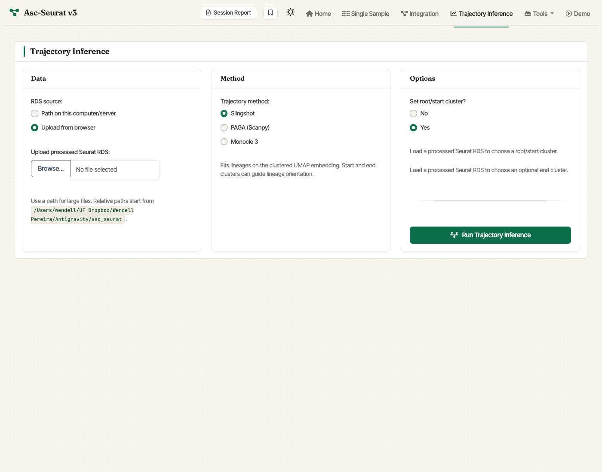

.. _trajectory_inference:

Trajectory inference
====================

Asc-Seurat v3 removes the Dynverse dependency and replaces it with three
supported methods that share the same Shiny controls:

- **Slingshot** (default) — fits lineages on the clustered UMAP
  embedding. Start and end clusters can guide lineage orientation, and
  the results include a compact minimum-spanning-tree graph of the
  inferred cluster relationships.
- **PAGA** — estimates connectivity between clusters and calculates
  pseudotime from the selected root cluster.
- **Monocle 3** — learns a Monocle 3 principal graph on the existing
  UMAP and orders cells from the selected root cluster.

Running trajectory inference
----------------------------

The Trajectory Inference tab takes a clustered Seurat object as input.
You can load it in two ways:

- **Upload from browser** — the default and most convenient option for
  moderate-sized objects.
- **Path on this computer/server** — best for very large RDS files, where
  the browser upload limit is a concern. Relative paths are resolved
  against the working directory shown beneath the input.

For all three methods you can:

- pick the trajectory method (Slingshot / PAGA / Monocle 3),
- choose a **root/start cluster**; this is strongly recommended so the
  pseudotime orientation is explicit,
- optionally fix an **end cluster** (Slingshot only),
- inspect the resulting pseudotime plot and trajectory graph,
- export the trajectory object.

   v3 Trajectory Inference tab. Upload a clustered Seurat RDS or provide
   a server path, pick **Slingshot**, **PAGA**, or **Monocle 3**, and set
   a root/start cluster before running inference.

Trajectory gene discovery
-------------------------

Each trajectory method exposes a gene-discovery workflow that matches the
method's underlying model.

For **Slingshot**, the Shiny workflow exposes three trajectory-DE engines:

- **PseudotimeDE-fast** (recommended default). Fast, well-suited to the
  Slingshot pseudotime produced by Asc-Seurat.
- **scMaSigPro**. Polynomial-regression alternative; identifies genes
  that change significantly along pseudotime.
- **tradeSeq**. More flexible but slower; the UI labels it as a
  long-runtime option and lets you tune the number of knots.

Set the *Top genes to display/plot* control to limit how many top genes
are shown in the displayed table and plots; all variable genes are
tested regardless.

For **PAGA**, the workflow focuses on connected states rather than
lineage-specific DE:

- **Connected cluster markers** compares selected or top-connected PAGA
  cluster pairs with Seurat marker testing.
- **Pseudotime-associated genes** ranks genes that vary along cells in
  the selected connected clusters.

For **Monocle 3**, Asc-Seurat uses Monocle 3's graph-based test to rank
genes that vary over the learned principal graph. The optional gene-module
step groups significant trajectory-variable genes into modules.

Installing the Python and R dependencies
----------------------------------------

The Docker image bundles the trajectory and DE dependencies. R package
users should install them on demand:

- **PAGA**: requires ``scanpy``. Run ``ascseurat::setup_paga()`` from
  R to verify or prepare the Python environment.
- **Monocle 3**: install from CRAN/Bioconductor (``BiocManager::install
  ("monocle3")``) or from GitHub.
- **PseudotimeDE-fast**: install from GitHub with
  ``remotes::install_git("https://github.com/dsong-lab/PseudotimeDE.git")``.
- **scMaSigPro** and **tradeSeq**: install from their respective
  Bioconductor / GitHub locations.
